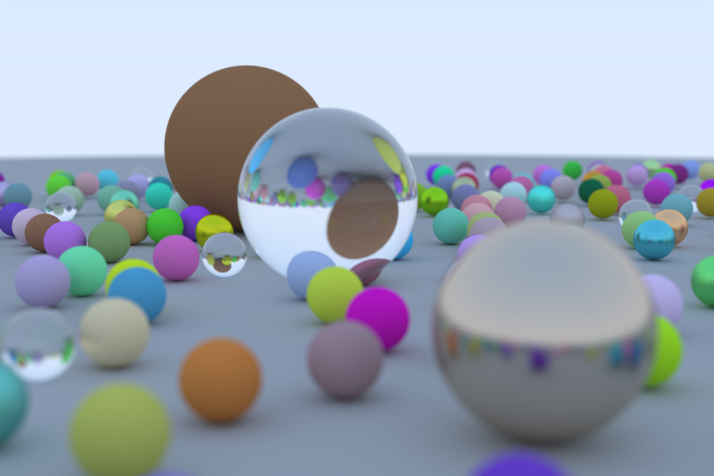

# Raytracing C#

\- An implementation of [Ray Tracing in One Weekend](https://raytracing.github.io/books/RayTracingInOneWeekend.html) in C#

### Examples

_Random test scene with 1200 samples and 200 depth limit._
_Render time with multithreading on a AMD Ryzen 5 3600: ~2 hours and 20 mintues, but 1200 samples is pretty much overkill._
